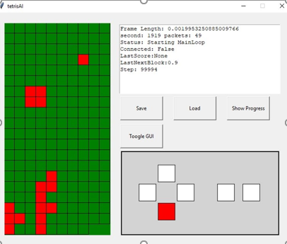

# TetrisAI

This is my try of creating a Tetris Ai.

- Motivation
- Goal Definition
- Description
- Conclusion
- Learnings
- Installation
- External Tools

## Motivation

My Motivation for this Project was to learn python and make experience with Ai. This Project was also made for School.

## Goal Definition

My goal was it to create a programm which can Play Tetris. I wanted to use reinforcement learning for the learning Algorithm . As a programming language i wanted to use Python, which i never really used.
 
I don't wanted to reprogramm Tetris. I thought it was faster to use an emulator and write a Lua script which communicates with my Python programm via Sockets. 
 

## Description

My Project is split into three parts. 
- AI 
- Lua Script
- Gui

The Gui displays some information 
The Lua Script is the code, which runs on the emulator 
The AI part is... well..it's the AI related part of this Project.

The Gui was easy. I used Tkinter. 

The Lua part was way mor difficult, because i din't know how to write Lua. 
Another reason was in order to send the information, i have to know which information i wanted to send.
The Gamefield itself wasn't difficult. I can just grab the Pixel Color and look, if it is black and send this information in a byte stream.

The NextBlock and the score was not so easy. Because i can´t simply read the information from the screen. I had to read it from the memory. The problem was that i didn't knew where the information was stored. I had to simply try it. after some time I found the locations.

The AI Part was the most difficult one.  
I used keras RL-2 and a DQN Agent.

The reward function has changed so many times. I tried many, many, many variations of the reward algorithm. The one in the code now is just the last one i've tried.

## Conclusion

I was not able to accomplish the goal completely.
The Ai is just not smart. I´ve tried uncountable variations of my code. It was foolish to think that someone who have never done anything with AI can accomplish a goal like this.

My biggest problem was that i was not abel to isolate the problems

- size of the neural network
- reward function
- other error in my code
- learning rate
- ...

At the end it's sad that it didn't work, because a lot of my time went in this project.  
I think i learned a lot, so it ok.

## Learnings

- concept of AI
- improved my Python Skills
- learned tkinter
- learned keras rl-2
- learned lua
- make small steps. I think, i should have done easier projects before this.

## Installation

You have to have PYthon 1.9 Installed.

For legal reasons, the Rom and the Emulator aren't in this repository. 
They have to be added at the following positions:
Mesen Emulator:
"/Emulator/Mesen.exe"
TetrisEuropePalRom:
"/Emulator/Tetris (Europe).nes"

After those files have been added, you can start the 00StartAll.ps1 file.

The Emulator as well as the Python programm will start and connect. The Ai will take over.

## External Tools
- Python
- Lua
- Keras rl-2
- tkinter
- Mesen(Emulator)

PS: I know that the code bacame really messy. This is a result of all the changes i made to the code over and over again
